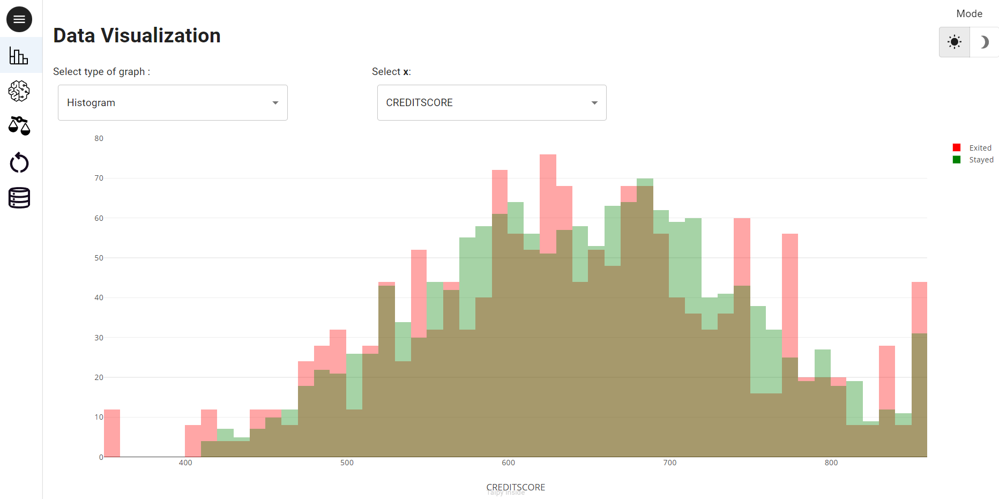

# Demo Churn Classification

## Usage
- [Usage](#usage)
- [Demo Churn classification](#what-is-demo-churn-classification)
- [Directory Structure](#directory-structure)
- [License](#license)
- [Installation](#installation)
- [Contributing](#contributing)
- [Code of conduct](#code-of-conduct)

## What is demo churn classification

Taipy is a Python library for creating Business Applications. More information on our
[website](https://www.taipy.io).

[Demo Churn Classification](https://github.com/Avaiga/demo-churn-classification) is a demo that predicts the customer churn for a company. Predicting which customers are likely to leave the company has become an essential process. The demo provides different pages to display the input data as well as the results of the Churn prediction. Here two models have been used:

- A logistic Regression model referred to as the ‘Baseline’
- A Random Forest Model referred as ‘ML”

A training dataset and test dataset are prepared from a provided dataset. Many features are being used from Credit Score, Age, Tenure, etc. The target variable is a boolean field named “OilPeakRate”.

### Demo Type

**Level**: Advanced

**Topic**: Taipy-GUI, Taipy-Core

**Components**: Many common Taipy-Core and Taipy-GUI functions

Full application showing how Taipy Core and Taipy Gui can work together to build a minimalist but powerful application. A lot of the Taipy controls are being used. 

The demo shows how to use scenarios, pipelines and how to compare the two pipelines.

### Data Visualization

  

This is the first page of the application, which allows the users to perform some level of EDA (Exploratory Data Analysis). 
The user can select the type of graph (scatter plot or histogram)  and the data content (the input data to be displayed).

### Model Manager

By clicking on the  icon on the left panel, you will see the results of the performance of the selected model/algorithm.

By selecting the algorithm as well as the type of chart, you will be able to visualize the results of the predictions (on a validation dataset).

### Comparing Models
By clicking on the  icon on the left panel, you will get to another page displaying the performance of the 2 models side by side.

### Databases
By clicking on  icon, you can display:

- The training dataset
- The test data set
- The forecast/scoring (based on the test data set) of the selected algorithm/model. You can notice that the correct prediction are highlighter in green where the wrong predictions are highlight in red).
- The Confusion Matrix of the selected algo/model.

A ‘Download’ button is present to download the specified data frame as a CSV file.

## Directory Structure

- `src/`: Contains the demo source code.
  - `src/algos`: Contains the functions to be executed as tasks by Taipy.
  - `src/config`: Contains the configuration files.
  - `src/data`: Contains the application data files.
  - `src/images`: Contains the application image files.
  - `src/pages`: Contains the page definition files.
- `CODE_OF_CONDUCT.md`: Code of conduct for members and contributors of _demo-churn-classification_.
- `CONTRIBUTING.md`: Instructions to contribute to _demo-churn-classification_.
- `INSTALLATION.md`: Instructions to install _demo-churn-classification_.
- `LICENSE`: The Apache 2.0 License.
- `Pipfile`: File used by the Pipenv virtual environment to manage project dependencies.
- `README.md`: Current file.

## License
Copyright 2022 Avaiga Private Limited

Licensed under the Apache License, Version 2.0 (the "License"); you may not use this file except in compliance with
the License. You may obtain a copy of the License at
[http://www.apache.org/licenses/LICENSE-2.0](https://www.apache.org/licenses/LICENSE-2.0.txt)

Unless required by applicable law or agreed to in writing, software distributed under the License is distributed on
an "AS IS" BASIS, WITHOUT WARRANTIES OR CONDITIONS OF ANY KIND, either express or implied. See the License for the
specific language governing permissions and limitations under the License.

## Installation

Want to install _demo-churn-classification_? Check out our [`INSTALLATION.md`](INSTALLATION.md) file.

## Contributing

Want to help build _demo-churn-classification_? Check out our [`CONTRIBUTING.md`](CONTRIBUTING.md) file.

## Code of conduct

Want to be part of the _demo-churn-classification_ community? Check out our [`CODE_OF_CONDUCT.md`](CODE_OF_CONDUCT.md) file.
